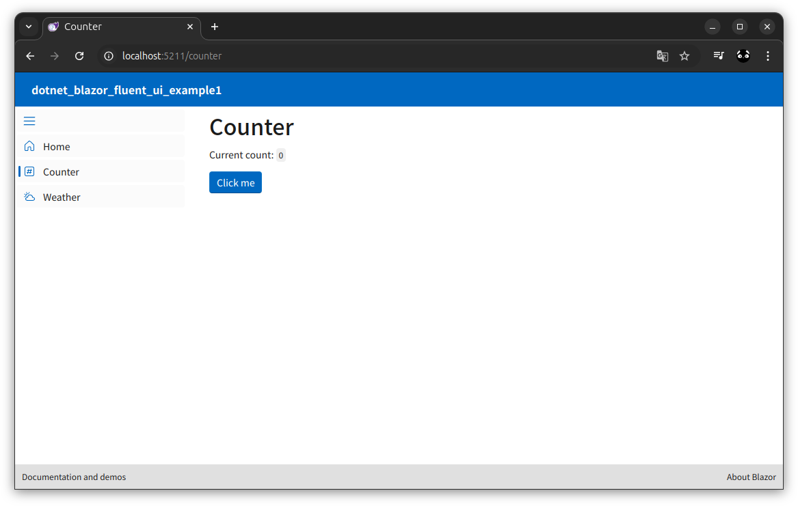

# dotnet_blazor_fluent_ui_example1

## 概要
* Microsoft Fluent UI Blazor components の fluentblazor テンプレートの構成確認
* blazor と fluentblazor テンプレートの構成差異調査



Microsoft Fluent UI Blazor components  
https://github.com/microsoft/fluentui-blazor  

Fluent UI Blazor Demo site  
https://www.fluentui-blazor.net/  

Tobotobo - Fluent UI 関連のプロジェクト  
https://github.com/Tobotobo/my_knowledge_base/issues/27  

## 環境
* ubuntu.24.04-x64
* dotnet 8.0.108

## blazor テンプレートと fluentblazor テンプレートの差異

※差異の詳細は https://github.com/Tobotobo/dotnet_blazor_fluent_ui_example1/commit/191f55c533ecb0fe3733ac2218e2413ab841455e?diff=split&w=1 を参照

### Components/App.razor
* `<link rel="stylesheet" href="bootstrap/bootstrap.min.css" />` 削除
* `<link rel="icon" type="image/x-icon" href="favicon.ico" />` png から icon に変更

### Components/Layout/MainLayout.razor
* Fluent コンポーネントに置き換え

### Components/Layout/MainLayout.css
* 削除

### Components/Layout/NavMenu.razor
* Fluent コンポーネントに置き換え

### Components/Layout/NavMenu.css
* 削除

### Components/Pages/Counter.razor
* Fluent コンポーネントに置き換え

### Components/Pages/Home.razor
* Welcome に Fluent Blazor の文言追加

### Components/Pages/Weather.razor
* Fluent コンポーネントに置き換え　※table から FluentDataGrid に変更
* forecasts を配列から IQueryable に変更

### Components/_Imports.razor
* `@using Microsoft.FluentUI.AspNetCore.Components` 追加

### Program.cs
* `using Microsoft.FluentUI.AspNetCore.Components;` 追加
* `builder.Services.AddFluentUIComponents();` 追加

### dotnet_blazor_fluent_ui_example1.csproj
* `<PackageReference Include="Microsoft.FluentUI.AspNetCore.Components" Version="4.*-* " />` 追加
* `<PackageReference Include="Microsoft.FluentUI.AspNetCore.Components.Icons" Version="4.*-* " />` 追加

### wwwroot/app.css
* `@import '/_content/Microsoft.FluentUI.AspNetCore.Components/css/reboot.css';` 追加
* 全体的に変更あり

### wwwroot/bootstrap
* フォルダごと削除

## 詳細

### テンプレートのインストール
```
> dotnet new install Microsoft.FluentUI.AspNetCore.Templates
次のパッケージがインストールされます:
   Microsoft.FluentUI.AspNetCore.Templates

成功: Microsoft.FluentUI.AspNetCore.Templates::4.9.3により次のテンプレートがインストールされました。
テンプレート名                                   短い名前          言語  タグ                             
-----------------------------------------------  ----------------  ----  ---------------------------------
Fluent Blazor Web アプリ                         fluentblazor      [C#]  Web/Fluent/Blazor/WebAssembly    
Fluent Blazor WebAssembly スタンドアロン アプリ  fluentblazorwasm  [C#]  Web/Fluent/Blazor/WebAssembly/PWA
```

### プロジェクトの作成
```
dotnet new fluentblazor
```

### コマンドヘルプ: fluentblazor
```
$ dotnet new fluentblazor --help
Fluent Blazor Web アプリ (C#)
作成者: Microsoft
説明: サーバー側のレンダリングとクライアントの対話機能の両方をサポートする Blazor Web アプリを作成するためのプロジェクト テンプレートです。このテンプレートは、リッチな動的ユーザー インターフェイス (UI) を持つ Web アプリに使用できます。
このテンプレートには、Microsoft 以外のパーティのテクノロジーが含まれています。詳しくは、https://aka.ms/aspnetcore/8.0-third-party-notices をご覧ください。

使用法:
  dotnet new fluentblazor [options] [テンプレート オプション]

オプション:
  -n, --name <name>       作成される出力の名前です。名前を指定しない場合は、出力ディレクトリの名前が使用されます。
  -o, --output <output>   生成された出力を配置する場所。
  --dry-run               指定されたコマンドラインがテンプレートを実行した場合に発生する結果の概要を表示します。
  --force                 既存のファイルが変更された場合でも、コンテンツを強制的に生成します。
  --no-update-check       テンプレートをインスタンス化する場合に、テンプレート パッケージの更新の確認を無効にします。
  --project <project>     コンテキストの評価に使用する必要があるプロジェクトです。
  -lang, --language <C#>  テンプレート言語を指定してインスタンスを作成します。
  --type <project>        テンプレートの種類を指定してインスタンスを作成します。

テンプレート オプション:
  -f, --framework <net8.0>                              プロジェクトのターゲット フレームワークです。
                                                        種類: choice
                                                          net8.0  ターゲット net8.0
                                                        既定: net8.0
  --no-restore                                          指定した場合、作成時にプロジェクトの自動復元がスキップされます。
                                                        種類: bool
                                                        既定: false
  --exclude-launch-settings                             生成されたテンプレートから launchSettings.json を除外するかどうか。
                                                        種類: bool
                                                        既定: false
  -int, --interactivity <Auto|None|Server|WebAssembly>  対話型コンポーネントに使用するホスティング プラットフォームを選択します
                                                        種類: choice
                                                          None         インタラクティビティなし (静的サーバー レンダリングのみ)
                                                          Server       サーバーで実行
                                                          WebAssembly  WebAssembly を使用してブラウザーで実行します
                                                          Auto         WebAssembly 資産のダウンロード中にサーバーを使用してから、WebAssembly を使用します
                                                        既定: Server
  -e, --empty                                           基本的な使用パターンを示すサンプル ページとスタイルを省略するかどうかを構成します。
                                                        種類: bool
                                                        既定: false
  -au, --auth <Individual|None>                         使用する認証の種類
                                                        種類: choice
                                                          None        認証なし
                                                          Individual  個別の認証
                                                        既定: None
  -uld, --use-local-db                                  SQLite の代わりに LocalDB を使用するかどうか。このオプションは、--auth Individual が指定されている場合にのみ適用されます。
                                                        種類: bool
                                                        既定: false
  -ai, --all-interactive                                最上位レベルで対話型レンダリング モードを適用して、すべてのページを対話型にするかどうかを構成します。false の場合、ページは既定で静的サーバー レンダリングを使用し、ページ単位またはコンポーネント単位で対話型としてマークできます。
                                                        有効な場合: (InteractivityPlatform != "None")
                                                        種類: bool
                                                        既定: false
  --no-https                                            HTTPS をオフにするかどうか。このオプションは、Individual が --auth に使用されていない場合にのみ適用されます。
                                                        種類: bool
                                                        既定: false
  --use-program-main                                    最上位レベルのステートメントではなく、明示的な Program クラスと Main メソッドを生成するかどうか。
                                                        種類: bool
                                                        既定: false
```
### コマンドヘルプ: fluentblazorwasm
```
> dotnet new fluentblazorwasm --help
Fluent Blazor WebAssembly スタンドアロン アプリ (C#)
作成者: Microsoft
説明: WebAssembly で実行される Blazor アプリを作成するためのプロジェクト テンプレート。このテンプレートは、高度でダイナミックなユーザー インターフェイス (UI) を備えた Web アプリに使用できます。
このテンプレートには、Microsoft 以外のパーティのテクノロジーが含まれています。詳しくは、https://aka.ms/aspnetcore/8.0-third-party-notices をご覧ください。

使用法:
  dotnet new fluentblazorwasm [options] [テンプレート オプション]

オプション:
  -n, --name <name>       作成される出力の名前です。名前を指定しない場合は、出力ディレクトリの名前が使用されます。
  -o, --output <output>   生成された出力を配置する場所。
  --dry-run               指定されたコマンドラインがテンプレートを実行した場合に発生する結果の概要を表示します。
  --force                 既存のファイルが変更された場合でも、コンテンツを強制的に生成します。
  --no-update-check       テンプレートをインスタンス化する場合に、テンプレート パッケージの更新の確認を無効にします。
  --project <project>     コンテキストの評価に使用する必要があるプロジェクトです。
  -lang, --language <C#>  テンプレート言語を指定してインスタンスを作成します。
  --type <project>        テンプレートの種類を指定してインスタンスを作成します。

テンプレート オプション:
  -f, --framework <net8.0>                               プロジェクトのターゲット フレームワークです。
                                                         種類: choice
                                                           net8.0  ターゲット net8.0
                                                         既定: net8.0
  --no-restore                                           指定した場合、作成時にプロジェクトの自動復元がスキップされます。
                                                         種類: bool
                                                         既定: false
  -au, --auth <Individual|IndividualB2C|None|SingleOrg>  使用する認証の種類
                                                         種類: choice
                                                           None           認証なし
                                                           Individual     個別の認証
                                                           IndividualB2C  Azure AD B2C を使用した個別の認証
                                                           SingleOrg      単一テナントの組織認証
                                                         既定: None
  --authority <authority>                                OIDC プロバイダーの権限 (個別のスタンドアロン認証で使用)。
                                                         種類: string
                                                         既定: https://login.microsoftonline.com/
  --aad-b2c-instance <aad-b2c-instance>                  接続先の Azure Active Directory B2C インスタンス (IndividualB2C 認証で使用)。
                                                         種類: string
                                                         既定: https:////aadB2CInstance.b2clogin.com/
  -ssp, --susi-policy-id <susi-policy-id>                このプロジェクトのサインインおよびサインアップのポリシー ID (IndividualB2C 認証で使用)。
                                                         種類: string
                                                         既定: b2c_1_susi
  --aad-instance <aad-instance>                          接続先の Azure Active Directory インスタンス (SingleOrg 認証で使用)。
                                                         種類: string
                                                         既定: https://login.microsoftonline.com/
  --client-id <client-id>                                このプロジェクトのクライアント ID (スタンドアロン シナリオでは、IndividualB2C、SingleOrg、または個別の認証で使用します)。
                                                         種類: string
                                                         既定: 33333333-3333-3333-33333333333333333
  --domain <domain>                                      ディレクトリ テナントのドメイン (SingleOrg または IndividualB2C 認証で使用)。
                                                         種類: string
                                                         既定: qualified.domain.name
  --app-id-uri <app-id-uri>                              呼び出すサーバー API のアプリ ID URI (SingleOrg または IndividualB2C 認証で使用)。
                                                         種類: string
                                                         既定: api.id.uri
  --api-client-id <api-client-id>                        サーバーがホストする API のクライアント ID (IndividualB2C、SingleOrg で使用)。
                                                         種類: string
                                                         既定: 11111111-1111-1111-11111111111111111
  -s, --default-scope <default-scope>                    アクセス トークンのプロビジョニングするためにクライアントが要求する必要がある API スコープ。(IndividualB2C、SingleOrg で使用)。
                                                         種類: string
                                                         既定: access_as_user
  --tenant-id <tenant-id>                                接続先のディレクトリの TenantId ID (SingleOrg 認証で使用)。
                                                         種類: string
                                                         既定: 22222222-2222-2222-2222-222222222222
  -r, --org-read-access                                  このアプリケーションにディレクトリへの読み取りアクセスを許可するかどうか (SingleOrg にのみ適用されます)。
                                                         種類: bool
                                                         既定: false
  --exclude-launch-settings                              生成されたテンプレートから launchSettings.json を除外するかどうか。
                                                         種類: bool
                                                         既定: false
  -p, --pwa                                              指定した場合、インストールとオフラインでの使用をサポートするプログレッシブ Web アプリケーション (PWA) が生成されます。
                                                         種類: bool
                                                         既定: false
  -e, --empty                                            基本的な使用パターンを示すサンプル ページとスタイルを省略するかどうかを構成します。
                                                         種類: bool
                                                         既定: false
  --no-https                                             HTTPS をオフにするかどうか。このオプションは、Individual、IndividualB2C、SingleOrg、または MultiOrg が --auth に使用されていない場合にのみ適用されます。
                                                         種類: bool
                                                         既定: false
  -uld, --use-local-db                                   SQLite の代わりに LocalDB を使用するかどうか。このオプションは、--auth Individual または --auth IndividualB2C が指定されている場合にのみ適用されます。
                                                         種類: bool
                                                         既定: false
  --called-api-url <called-api-url>                      Web アプリから呼び出す API の URL。このオプションは、--auth SingleOrg、--auth MultiOrg、または --auth IndividualB2C で、ASP.NET Core ホストが指定されていない場合にのみ適用されます。
                                                         種類: string
                                                         既定: https://graph.microsoft.com/v1.0
  --called-api-scopes <called-api-scopes>                Web アプリから API を呼び出すために要求するスコープ。このオプションは、--auth SingleOrg、--auth MultiOrg、または --auth IndividualB2C で、ASP.NET Core ホストが指定されていない場合にのみ適用されます。
                                                         種類: string
                                                         既定: user.read
  --use-program-main                                     最上位レベルのステートメントではなく、明示的な Program クラスと Main メソッドを生成するかどうか。
                                                         種類: bool
                                                         既定: false
```
